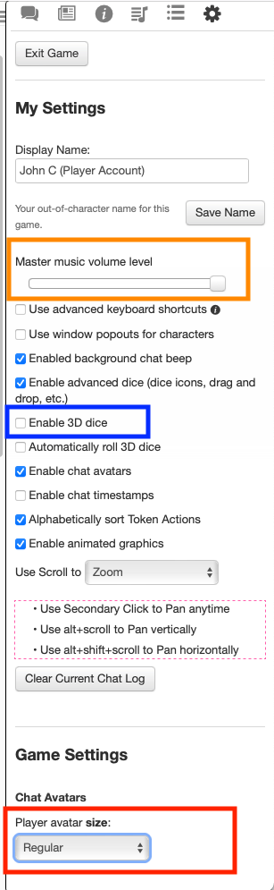

# DND Player Setup Notes
These are the player setup notes for my online 5ed campaigns.

## Requirements
All of these are free/freemium.  The free accounts will work for the campaigns.

- Mic/Headset/Speakers/etc.  (no video)
- Web Browser Compatible with Roll20 (i.e. Chrome, Firefox)
- Beyond 20 Plugin for your Browser: https://beyond20.here-for-more.info/install
- D&D Beyond Account: https://www.dndbeyond.com
- Roll20 Account: https://roll20.net
- Discord

## "Game Ready" Checklist
- [ ] Discord (ask me for link/invite)
- [ ] D&D Beyond Account
- [ ] Join Campaign on Beyond (ask me for link/invite)
- [ ] Roll20 Account
- [ ] Join Roll20 "Game" (ask me for link/invite)
- [ ] A game token -- make your own, see 'Tokens' below.
- [ ] Game Token Posted in Discord
- [ ] DM will make your character in Roll20
- [ ] DM will associate game token with character

## How To Do Stuff

### Tokens
To represent yourself on the board in Roll20, create a token.  If you're feeling creative, you can do this yourself *or* you can use 'Token Stamp'.

To do that, visit ['Token Stamp 2'](https://rolladvantage.com/tokenstamp/), drag an image onto the screen, select your options and download your token.

### Getting your Token In Game
Only the DM can do this.  Post it in Discord and I'll add it for you and associate it with your roll20 character.

### Learning to Play / Learning 5ed
It will take about 30 minutes to learn to play, and it's easy enough to learn as we go.

* If you want, you can read this: https://media.wizards.com/2018/dnd/downloads/DnD_BasicRules_2018.pdf
* If you create a D&D Beyond account and join the campaign I can share my digital books with you.  Note that my digital books will have more classes and races not available in the basic rules above.
* There is a slight learning curve with using the virtual table top (Roll20) and interacting with it from your character sheet (in D&D Beyond).

### Table Top
We will use Roll20 as a virtual table top for encounters / dungeons (and rolling).

### Rolling
You don't need dice.  D&D Beyond allows you to make rolls and it will share them automatically (via Beyond20).  

## Useful Settings
I've marked a few useful setting thingies (found on the gear tab in roll20)
- Orange Box : Adjust the music level for you.
- Blue Box : Turn this on, it'll show dice rolls on the table in Roll20.
- Red Box : Select 'Names Only' and it'll save you some screen real estate.

